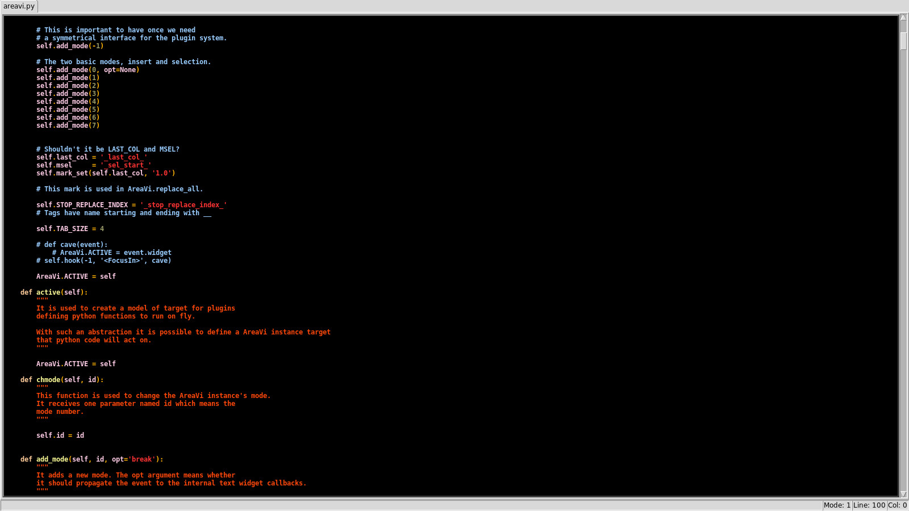

 vy
================

A vim-like in python made from scratch.

What is vy? 
It is an attempt of mine(Tau a.k.a Iury) to implement a vim-like editor in python.
I feel as i'm close to this goal since i have been using vy for all kind of tasks 
that i used vim in the past.

Why would one implement a vim-like in python? 
Well, python is such a powerful language, i used vim for years when i noticed vimscript wasn't
really cool and i couldn't use vim python plugin api in the way i would like.

Does vy mimic vim?
No, it is slightly similar, it has a standard mode, an insert mode and
some of the key-commands perform similar operations in vy and vim.

Vy supports an interesting feature, it is the capacity of talking to external processes
It is all thanks to untwisted although it could be done with any other library that supports a reactor
with a update function. The main idea behind to talking to external processes is the concept of e-scripts.

E-scripts are an interesting way of avoiding repeatitive tasks.

Install
=======

This is a short script to install the latest version of vy.

    cd /tmp
    git clone git@github.com:iogf/vy.git vy-code
    git clone git@github.com:iogf/untwisted.git untwisted-code 

    su
    cd /tmp/untwisted-code
    python setup.py install
    cd /tmp/vy-code
    python setup.py install

    apt-get install python-tk
    apt-get install python-pygments
    exit

    
Once you have installed vy and its dependencies.
Run on a terminal the following command.

    vy file1 file2 ...

Or just.

    vy

Videos
======

**Debugging applications with mainloop in vy, flask web app:**
https://www.youtube.com/watch?v=_It1I198130

**Vy as a shell:**
https://www.youtube.com/watch?v=CfByT5i2uWw

**Building graphical interfaces with vy:**
https://www.youtube.com/watch?v=_F0pjyrx3_4

**Using pdb with vy:**
https://www.youtube.com/watch?v=Ahachd4_N9U

**Running python code on the fly:**
https://www.youtube.com/watch?v=Rav3iz-VCN0
    
**Formating text with vy:**
https://www.youtube.com/watch?v=5JUnUCl-E1w

Screenshots
===========

**Dark Syntax Highlight Theme**

**Sun Syntax Highlight Theme**

Features
========

* A simple api once it is purely written in python
* Syntax highlight for all kind of langues supported by python-pygments
* A very powerful api since it written in python
* Execute python code on the fly that affects the behavior of the editor
* Talk to external processes like interpreters
* A powerful search scheme that permits formating text with regex and python code
* Quickly switching the cursor to positions based on a kind of fuzzy search

Documentation
=============

**A formal description of usage of all vy features**

[VY-BOOK.md](VY-BOOK.md)

Help
====

I hang out at irc.freenode.org in the channel #vy.
My nick there is Tau.

Vy facebook group.
https://www.facebook.com/groups/525968624207147/

