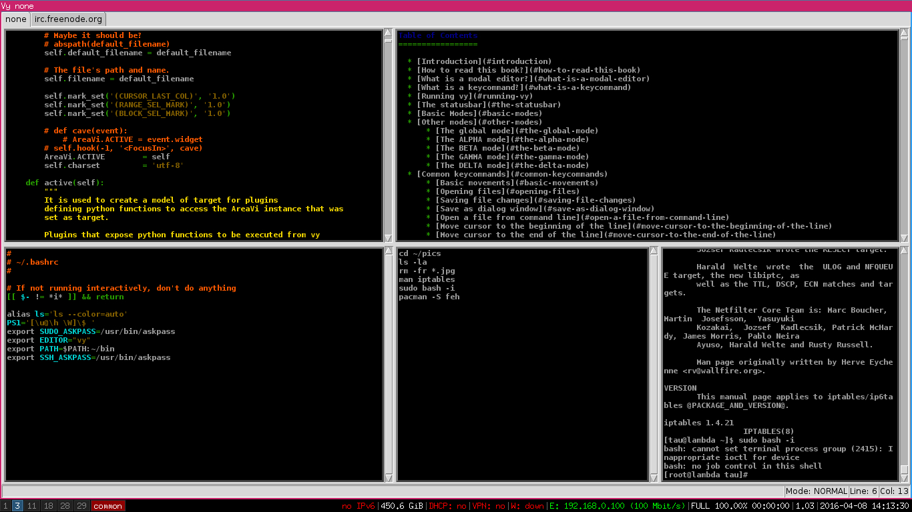

 vy
================

A powerful modal editor written in python.

vy is a modal editor with a very modular architecture. Everything is very minimalistic and modular. 
vy is built on top of Tkinter which is one of the most productive graphical toolkits; It permits vy
to have such a great programming interface for plugins. Python is such an amazing language;
it turns vy such a powerful application because its plugin API is high level naturally.

In vy it is easy to create modes like it is in emacs, modes that support programming languages, 
provide all kind of functionalities that varies from accessing irc or email checking.

There is no need for a mouse with vy, everything is made from the keyboard. There are tons of key commands to help 
you spare a lot of time when programming or just editing some text. vy has a handy set of key commands that
permits you to quickly switch the cursor to a given position. 

The set of keys used in vy was carefully chosen to be handy although it is possible to make vy look like vim or emacs since
there is a high level of modularity in vy.

There are ways to perform fuzzy searches whose input is a set of words, with the effect of finding lines which contain the words in any order;
Such a feature turns it simple browsing documentation of functions/commands as well as finding specific sections in large files.

The syntax highlighting plugin is very minimalistic and extremely fast. It supports syntax highlighting 
for all languages that python-pygments supports. The source code of the syntax highlighting plugin is about 
120 lines of code. It is faster than the syntax highlighting plugins of both vim and emacs. :)
It is possible to easily implement new syntax highlighting themes that work for all languages because it uses
python pygments styles scheme.

There is a simple and consistent terminal-like plugin in vy that turns it possible to talk to external processes.
Such a feature is very handy when dealing with interpreters. One can just drop pieces of code to an interpreter
then check the results. It is possible to run an SSH process then send commands and receive 
output from vy: it lets you access files over SSH on another machine.

The features of talking to proccesses and vy powerful fuzzy search schemes it makes vy a perfect tool to deal with
E-scripts. E-scripts are a very handy way to automate some tasks. Such tasks can be pushing stuff onto GitHub, adding users 
to a UNIX-like system, a set of steps to set up a system, etc. 

vy implements a Python debugger plugin and auto completion that permits debugging Python code easily and in a very cool way. 
One can set break points, remove break points, run the code then see the cursor jumping to the line 
that is being executed and much more.

It is possible to open multiple vertical/horizontal panes to edit different files. Such a feature makes it possible
to edit multiple files in a given tab. vy supports multiple tabs as well with a handy scheme of keys
to switch focus between tabs and panes. 

vy has a very well defined scheme for user plugins. One can easily develop a plugin then make vy load it.
There is a vyrc file written in Python that is very well documented and organized to make it simple to load
plugins and set stuff at startup. You can take the best out of vy with no need to learn some odd language
like vimscript or emacs LISP; since vy is written in Python, you use Python to develop for it.

All built-in functions are well documented, which simplifies the process of plugin development as well as personalizing stuff.
The plugins are documented: the documentation can be accessed from vy by dropping Python code to the interpreter.

The vy plugins are documented, the complete reference for a set of key commands that a plugin implements 
can be accessed easily from vy.
    

Features
========

- **Python Debugger**

- **Terminal**

- **Auto Completion**

- **Fuzzy Search**

- **Incremental Search**

- **Tabs/Panes**

- **Irc Client** 

- **Self documenting**

- **Extensible with Python**

- **Syntax highlighting for 300+ languages**

- **Handy Shortcuts**

Install
=======

**Note:** 
vy requires Python 2.7 to run.

    pip install pygments
    pip install jedi
    npm install tern
    pip install untwisted
    pip install vy

Once it is installed, run in a terminal:

    vy file1 file2 ...

Or just:

    vy

**Note:**
As vy is in development there may occur some changes to the vyrc file format, it is important to remove
your ~/.vy directory before a new installation in order to upgrade to a new version.

The vy Book
===========

[BOOK.md](BOOK.md)

Support
=======

#### Freenode

**Address:** irc.freenode.org

**Channel:** #vy

