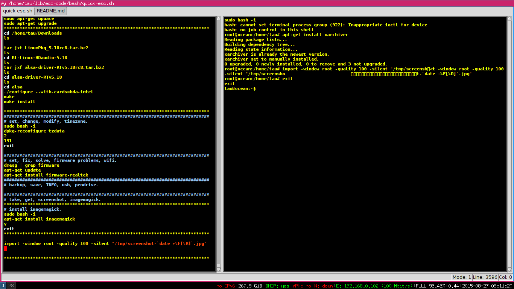

 vy
================

A powerful modal editor written in python.

Vy is a modal editor with a very modular architecture. Everything is very well minimalistic and modular. 
Vy is built on top of tkinter which is one of the most productive graphical toolkits. It permits vy
to have such a great programming interface for plugins. It is pretty straightfoward to implement a plugin for vy.

There is no need for mouse with vy, everything is made from the keyboard. There are tons of key commands to help 
you spare a lot of time when programming or just editing some text. Vy has a powerful set of key commands that
permits you quickly switch the cursor to a given position. 

There is simple but powerful scheme for finding patterns of text as well as replacing ranges of text with regular 
expressions. It is possible to select regions of text then perform matching operations inside such regions, 
such a feature lets you format some documents easier with no spending of time.

The syntax highlighting plugin is very minimalistic and extremely fast. It supports syntax highlighting 
for all languages that python-pygments supports. The source code of the syntax highlighting plugin is about 
80 lines of code. It is faster than both vim and emacs syntax highlighting plugins. :)

There is a powerful quick search scheme that permits making the cursor jump to positions of the file that match
a given pattern. Such a plugin makes it very handy to jump to specific positions of programming files.

There are plugins for highlighting pairs of (), [], {} as well as selecting the text between these pairs 
It is very useful when playing with function definitions in some languages like lisp.

Vy has a plugin that implements a mode to quickly jump backwards/fowards to a given character. It is possible
to go through some blocks of code very fast as well as quickly edit some pieces of text. Such a plugin
uses very handy keys.

It is possible to easily implement new syntax highlighting themes that work for all languages.
The syntax highlighting plugin permits you to set specific background/colour for a language tokens type.

Vy is written in pure python it permits you to drop python code to the interpreter that affects the editor state.
It lets you implement python functions to perform cool routines like posting code onto codepad.org, converting all text 
of a given opened file to lower case, finding unknown words in a given document, implement an irc client and much more.

The set of keys used in vy was carefully chosen to be handy although it is possible to make vy look like vim or emacs since
there is a high level of modularity in vy.

There is a simple and consistent terminal-like plugin in vy. It is possible to talk to external processes through bash.
Such a feature is very handy when dealing with interpreters. One can just drop pieces of code to a given interpreter 
through bash then check the results. Another important point of such a feature consists in implementing e-scripts 
to automatize tasks in unix like systems. It is possible to run a ssh process on top of bash then send commands and receive 
output from vy it lets you access files over ssh in other machine.

E-scripts are a very handy way to automatize some tasks. Such tasks can be pushing stuff onto github, adding users 
to a unix-like system, a set of steps to set up a system, increasing sound from terminal etc. 

Vy implements a python debugger plugin that permits debugging python code easily and in a very cool way. 
One can set break points, remove break points, run the code then see the cursor jumping to the line 
that is being executed and much more. It is pretty straightfoward to implement debuggers for other languages.

It is possible to open multiple vertical/horizontal areas to edit different files. Such a feature turns possible
to edit multiple files in a given tab. Vy supports multiple tabs as well.

Vy has a very well defined scheme for user plugins. One can easily develop a plugin then make vy load it.
There is a vyrc file written in python that is very well docummented and organized to turn it simple to load 
plugins and set stuff at startup. You can take the best out of vy with no need for learning some odd language
like vimscript or emacs lisp since vy is written in python, you use python to develop for it.

All builtin functions are well documented it turns simple the process of plugin development as well as personalizing stuff.
The plugins are documented, the docs can be accessed from vy by dropping python code to the interpreter.

The plugins implement keycommands or python functions. The complete reference for a set of keycommands that a plugin implements 
can be accessed from a python interpreter instance or from vy.
    
    help(vyapp.plugins.plugin_name)

One could implement as many modes as needed. This is very useful for specific situations. There could exist modes 
for ircclient, filemanagers, browsing specific type of files, generating latex code etc.

What did Bram Moolenaar say about vy?
=====================================

When i visited Bram in the beginning of vy development he told me that the philosophy behind
vy was great. He said that if i managed to do it extremely modular and clear it had a great chance
to substitute vim in the future.

I'm working on a ncurses based library with a symmetrical archicture to python tkinter. Once it is done
vy will run a text based terminal sweetly.

Install
=======

Vy actually demands python 2.7 to run.

This is a short script to install the latest version of vy.

    su
    apt-get install python-tk
    apt-get install python-pygments
    exit

    cd /tmp
    git clone git@github.com:iogf/vy.git vy-code
    git clone git@github.com:iogf/untwisted.git untwisted-code 

    cd /tmp/untwisted-code
    python setup.py install
    cd /tmp/vy-code
    python setup.py install

    
Once you have installed vy and its dependencies.
Run on a terminal the following command.

    vy file1 file2 ...

Or just.

    vy

Documentation
=============

**The intro**

[INTRO.md](INTRO.md)

**A guide on how to develop plugins**

[GUIDE.md](GUIDE.md)

Help
====

I hang out at irc.freenode.org in the channel #vy.
My nick there is Tau.

Vy facebook group.
https://www.facebook.com/groups/525968624207147/

Contributors
============

It is with great pleasure and emotion that i thank to all people who helped me
along vy development. They contributed with ideas, criticism and believed in the
idea of implementing an editor/ide in pure python on top of Tkinter that is such a great
graphical toolkit.

...

